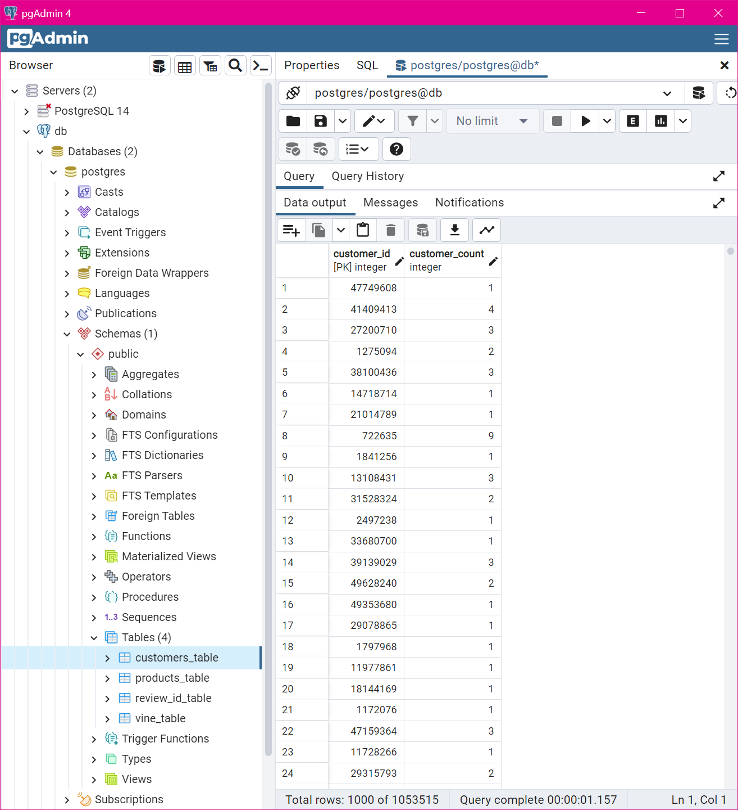
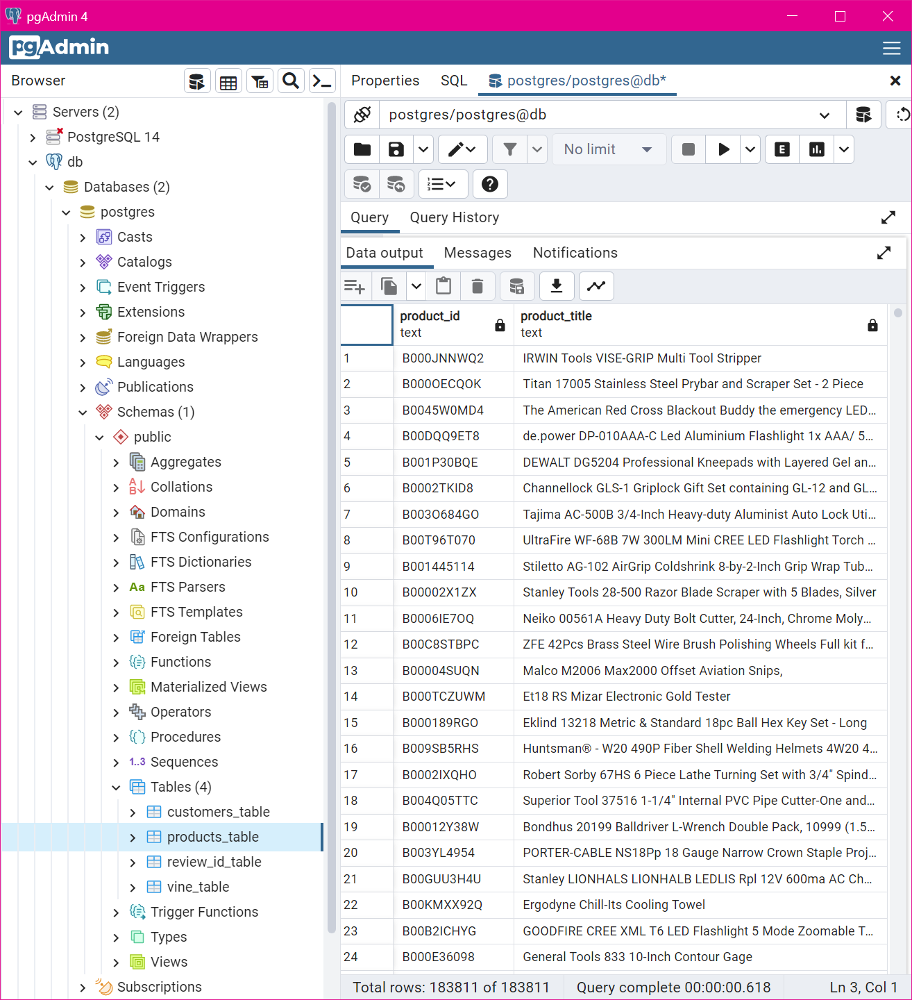
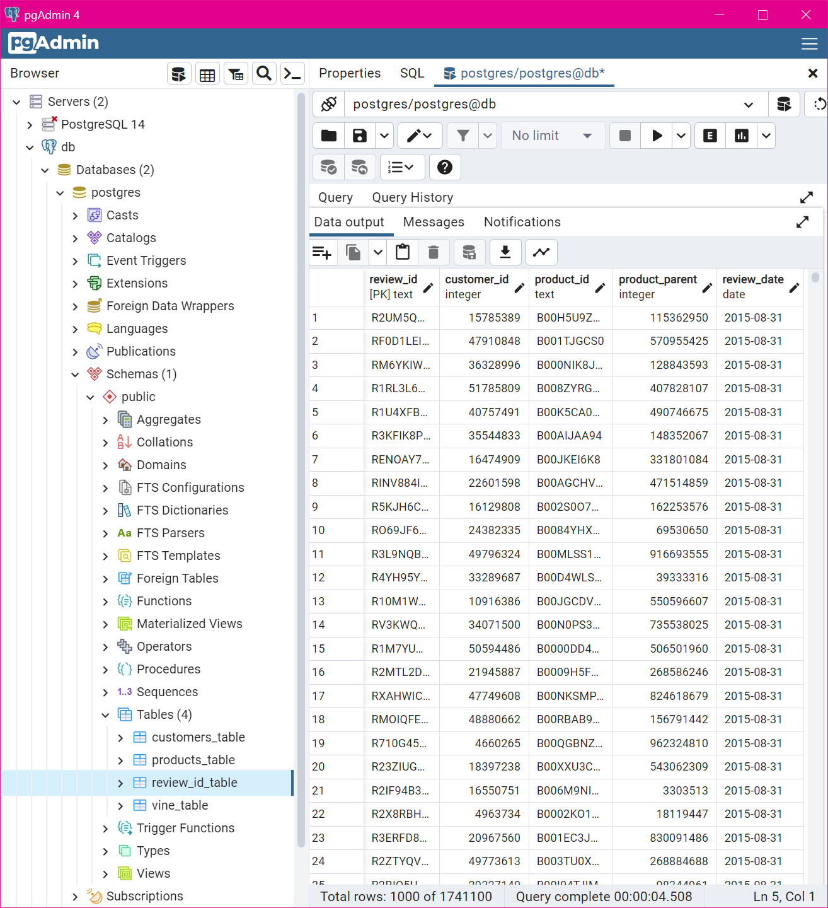
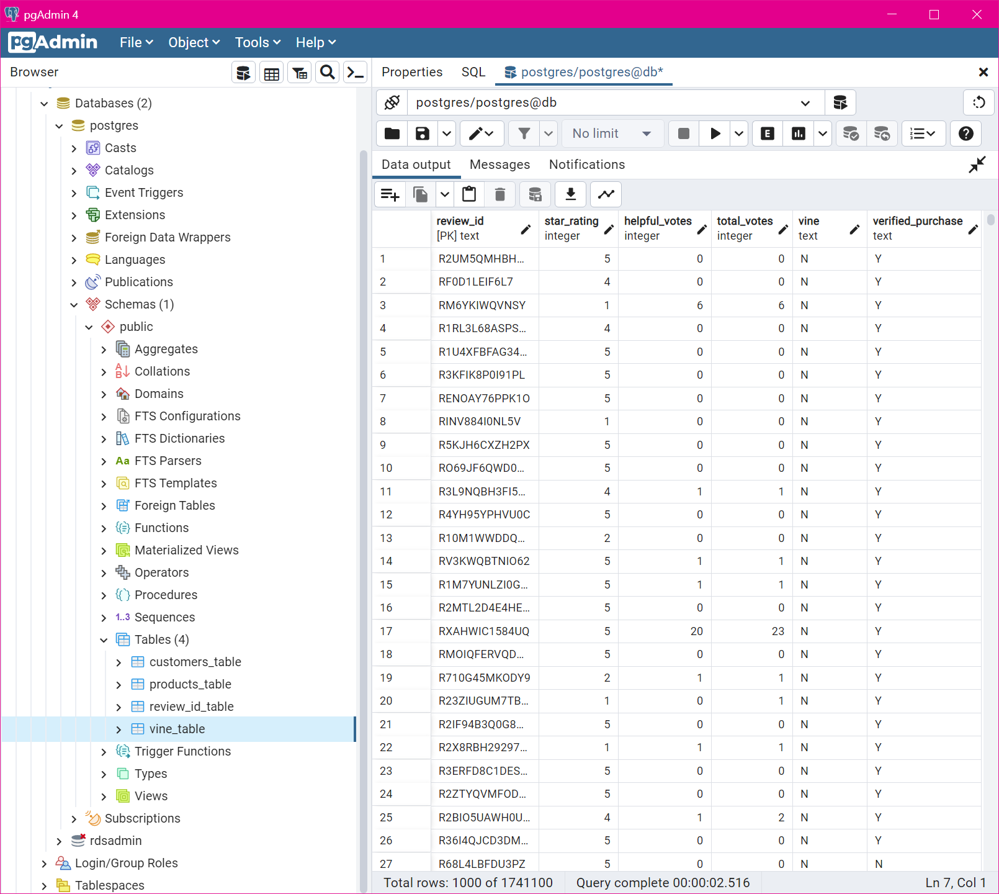
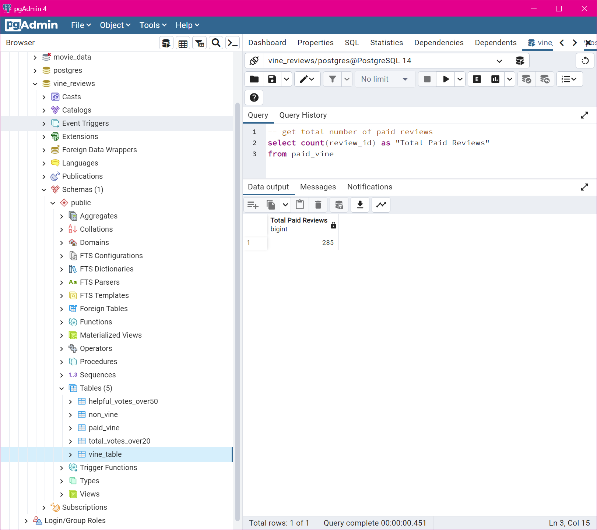
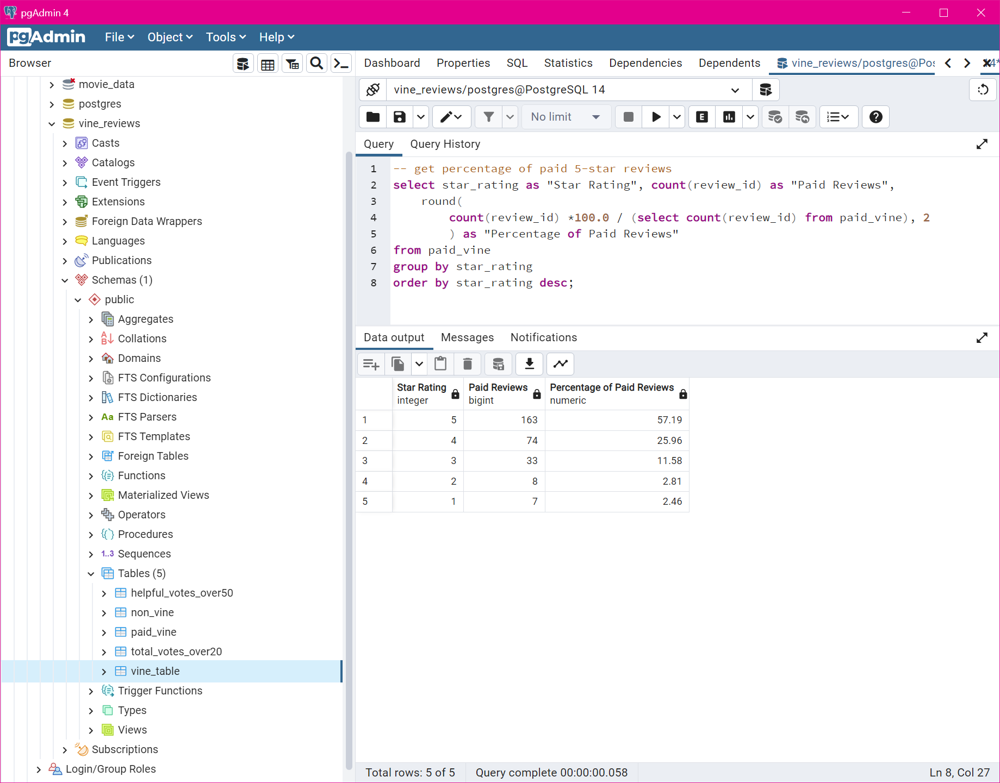
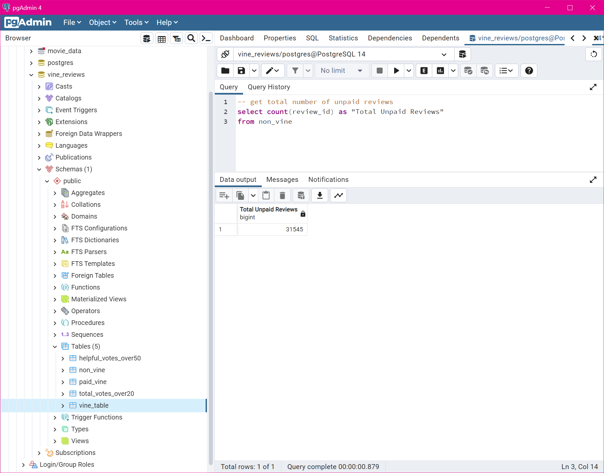
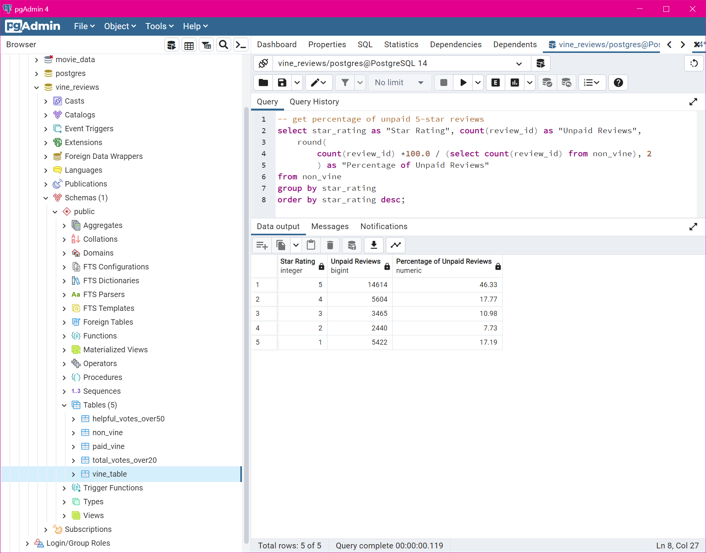

# Amazon Vine Reviews Analysis

## Overview of the Analysis
This analysis consisted of an ETL (Extract - Transform - Load) process using an Amazon product review dataset for Tools, and a determination of whether paid reviews have a bias towards 5-star ratings.

## Technology
This project included the following technologies:
* AWS (Amazon Web Services) - providing RDS (Relational Database service) and S3 (Simple Storage Service).
* Google Colab - This service enables Python code to be written and executed in the cloud.
* PySpark - This is the Python API for the distributed Apache Spark computing framework for real-time, large-scale data processing.
* PostgreSQL & pgAdmin4 - This is the database engine that was selected for the RDS database instance and the local data analysis.
* Amazon Reviews dataset - amazon_reviews_us_Tools_v1_00.tsv.gz

## ETL Process Details
#### Within AWS
* RDS was used to create a PostgreSQL database instance.

#### Locally
* pgAdmin4 was used to establish a connection to the RDS database.  Through this connection, a sql script was executed to build the tables that would contain the ETL process output data.

#### Within Google Colab
* A Jupyter notebook was created and a PySpark session was initiated.  
* The PySpark session extracted the Amazon review dataset from S3.
* The data was then transformed through multiple DataFrames to enable loading the data into the RDS database tables.
* A connection was opened to the RDS database instance, and the PySpark DataFrames were loaded into the PostgreSQL database.

#### Locally
* pgAdmin4 was used to query the database tables to confirm the data loaded.









## RDS Cleanup
An export of the RDS ```vine_table``` was loaded into a newly created local PosgreSQL database.

Upon successful import of this data into the local database, the RDS database was deleted.

## Determining the Bias of Vine "Tool" Reviews
Sql queries were written to identify relevant review data and then to examine the data and provide input for the analysis.

Details for the paid reviews follow below:

* The total number of paid reviews was identified


* The percentage of paid reviews by Star Rating was identified


Similarly, details for the unpaid reviews follow below:

* The total number of unpaid reviews was identified


* The percentage of unpaid reviews by Star Rating was identified


## Summary of Results
* Total Vine (paid) Reviews - 285
* Number of Vine (paid) 5-Star Reviews - 163
* Percentage of Vine (paid) 5-Star Reviews - 57.19%

* Total non-Vine (unpaid) Reviews - 31545
* Number of non-Vine (unpaid) 5-Star Reviews - 14614
* Percentage of non-Vine (unpaid) 5-Star Reviews - 46.33%

## Conclusion
The data collected through this analysis suggests that there is positivity bias within the Vine program.  This is because the percentage of 5-Star Reviews is much higher, given the much smaller population of the Vine reviews.

It is recommended that additional analysis be performed to determine if there is a statistically significant difference in the paid vs. unpaid reviews. A T-Test should be performed to provide this evidence and allow a statistical conclusion to be drawn.